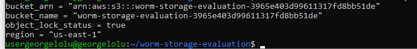
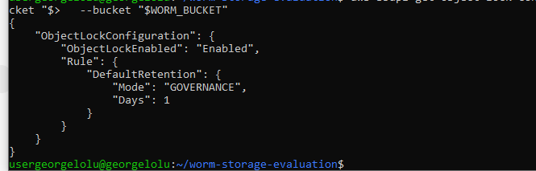
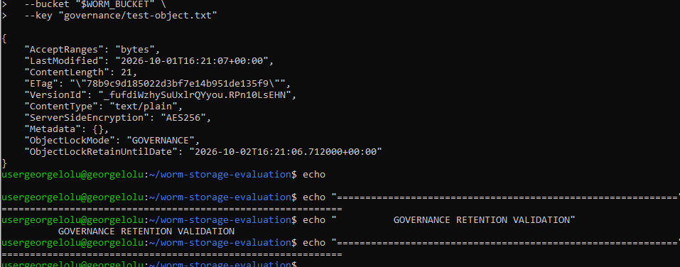
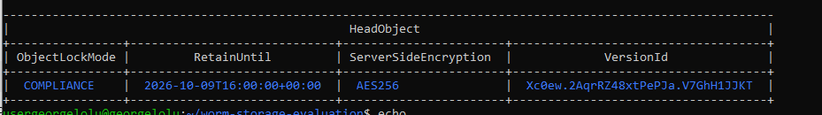
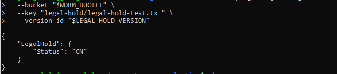
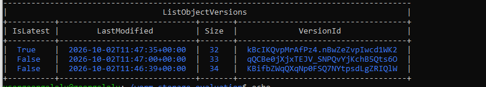
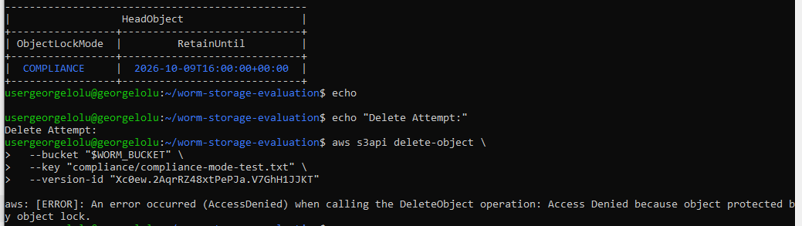
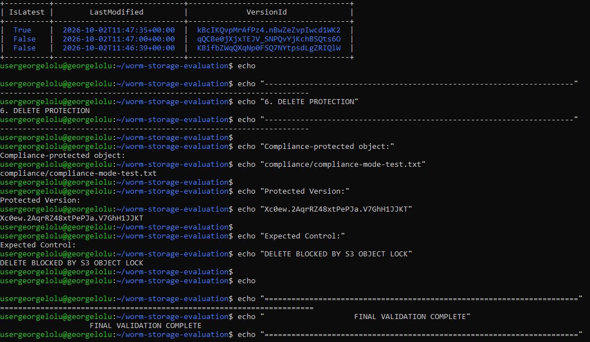

# WORM Storage Evidence

This directory contains execution evidence for the AWS S3 WORM Storage Evaluation project.

The evidence demonstrates the implementation and validation of S3 Object Lock, retention controls, legal holds, version preservation, and protection against object deletion.

## Evidence Matrix

| # | Evidence | Validation |
|---|---|---|
| 01 | Terraform Deployment | AWS WORM storage infrastructure deployed successfully with Terraform |
| 02 | Object Lock Enabled | S3 Object Lock configuration enabled on the bucket |
| 03 | Governance Retention | Object version protected using Governance retention mode |
| 04 | Compliance Retention | Object version protected using Compliance retention mode |
| 05 | Legal Hold | Object version protected with an active Legal Hold |
| 06 | Version Preservation | Multiple versions of an object preserved by S3 Versioning |
| 07 | Delete Protection | Attempted deletion of a protected object rejected by S3 Object Lock |
| 08 | Final Validation | Consolidated validation of the implemented WORM controls |

## Evidence Files

### 01 — Terraform Deployment

Demonstrates successful Terraform deployment and the resulting WORM storage infrastructure.

### 02 — Object Lock Enabled

Demonstrates that S3 Object Lock is enabled for the WORM storage bucket.

### 03 — Governance Retention

Demonstrates an object version protected using S3 Object Lock Governance mode with a defined retention period.

### 04 — Compliance Retention

Demonstrates an object version protected using S3 Object Lock Compliance mode with a defined retention period.

### 05 — Legal Hold

Demonstrates an object version with an active S3 Object Lock Legal Hold.

### 06 — Version Preservation

Demonstrates preservation of multiple object versions through S3 Versioning.

### 07 — Delete Protection

Demonstrates that deletion of an Object Lock protected version is rejected while the protection is active.

### 08 — Final Validation

Provides consolidated execution evidence for the WORM storage implementation and its primary immutability controls.

## Security Controls Demonstrated

- S3 Object Lock
- S3 Versioning
- Governance retention
- Compliance retention
- Legal Holds
- Server-side encryption
- Public access protection
- Protected object deletion
- Infrastructure as Code with Terraform
- Automated validation

## Evidence Integrity

The screenshots were captured during the actual AWS implementation and validation process. They are retained as project execution evidence and are intended to complement the Terraform configuration, validation scripts, architecture documentation, and evaluation results in this repository.
